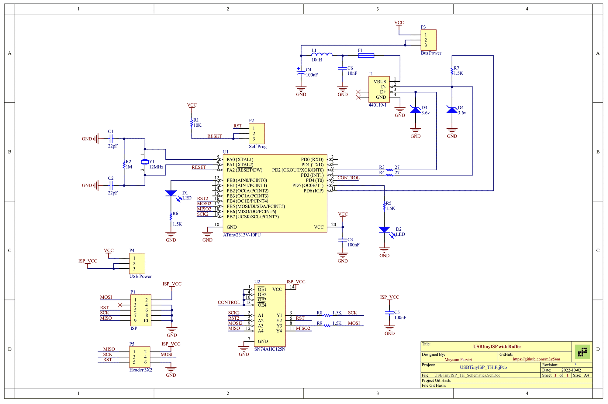

# USBTinyISP AVR Programmer Thru-Hole Version

Designed and built for University of Zanjan Robotics Association in 2015

The design is based on: [USBtinyISP](https://learn.adafruit.com/usbtinyisp)

